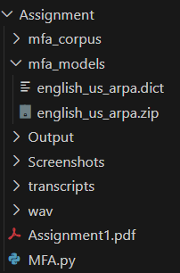
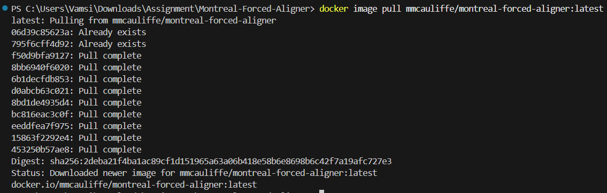
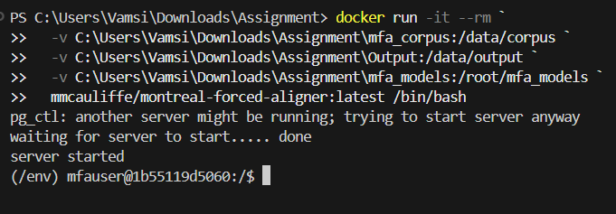
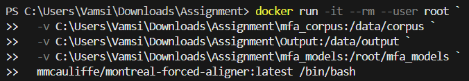
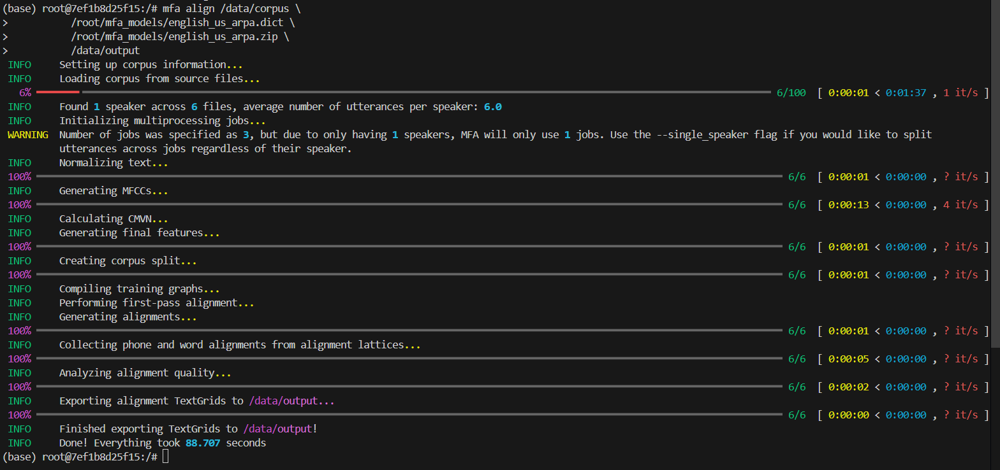
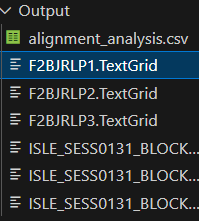
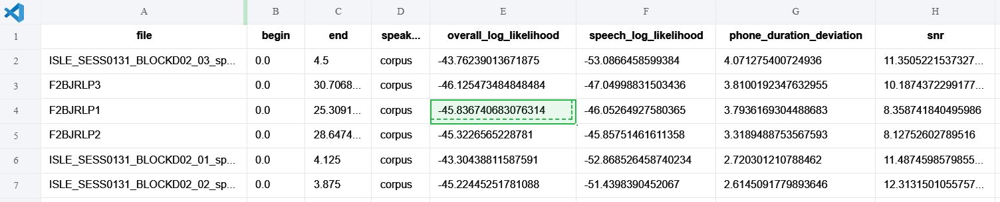
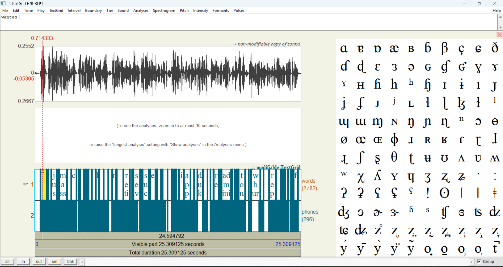

# IIIT-H Speech-to-Speech Assignment 1: Forced Alignment

This repository contains the submission for the forced alignment task using Montreal Forced Aligner (MFA).

## Objective

To set up and execute a complete forced alignment pipeline, aligning a provided speech corpus (WAV files) with its transcripts (TXT files) at the word and phoneme level.

## Final Outputs

- **TextGrid Files**: All generated `.TextGrid` files are available in the `/Output` folder (6 files total).
- **Quantitative Analysis**: The `alignment_analysis.csv` file containing alignment metrics is also in `/Output`.
- **Detailed Report**: A comprehensive analysis and visualization is available in `Report.pdf`.

## Project Structure

```
Assignment/
├── wav/                          # Original audio files
├── transcripts/                  # Original transcript files
├── mfa_corpus/                   # Processed corpus (WAV + LAB pairs)
├── mfa_models/                   # MFA acoustic model and dictionary
│   ├── english_us_arpa.dict
│   └── english_us_arpa.zip
├── Output/                       # Generated alignment outputs
│   ├── *.TextGrid               # Alignment files (6 files)
│   └── alignment_analysis.csv   # Quantitative metrics
├── Screenshots/                  # Documentation screenshots
├── MFA.py                        # Data preparation script
└── README.md                     # This file
```

## Execution: A Reproducible Docker Workflow

### 1. Initial Challenge: Environment Setup

Initial attempts to install MFA using Conda (`conda install -c conda-forge montreal-forced-aligner`) failed due to package metadata and environment solving conflicts.



### 2. Solution: Docker-Based Implementation

To ensure a 100% reproducible and stable environment, I pivoted to the official MFA Docker image as described in the [MFA documentation](https://montreal-forced-alignment.readthedocs.io/).

#### Pull the Official Docker Image

```bash
# Pull the official MFA Docker image
docker pull mmcauliffe/montreal-forced-aligner:latest
```



### 3. Data Preparation

The provided `wav` and `transcripts` folders were processed using the `MFA.py` script to create the `mfa_corpus` directory, which formats the data for MFA (matching `.lab` and `.wav` files).

#### Running the Data Preparation Script

```bash
python MFA.py
```

**What the script does:**
- Reads transcript files from `transcripts/` folder (handles both `.txt` and `.TXT` extensions)
- Matches each transcript with its corresponding WAV file from `wav/` folder
- Copies WAV files to `mfa_corpus/`
- Converts transcripts to `.lab` format (MFA requirement)
- Converts transcripts to uppercase (required for ARPA models)


**Output:** The `mfa_corpus/` directory contains 6 file pairs:
- `F2BJRLP1.wav` + `F2BJRLP1.lab`
- `F2BJRLP2.wav` + `F2BJRLP2.lab`
- `F2BJRLP3.wav` + `F2BJRLP3.lab`
- `ISLE_SESS0131_BLOCKD02_01_sprt1.wav` + `ISLE_SESS0131_BLOCKD02_01_sprt1.lab`
- `ISLE_SESS0131_BLOCKD02_02_sprt1.wav` + `ISLE_SESS0131_BLOCKD02_02_sprt1.lab`
- `ISLE_SESS0131_BLOCKD02_03_sprt1.wav` + `ISLE_SESS0131_BLOCKD02_03_sprt1.lab`

### 4. Model Download

The pre-trained `english_us_arpa` acoustic model (`.zip`) and dictionary (`.dict`) were downloaded from the [official MFA-Models GitHub repository](https://github.com/MontrealCorpusTools/mfa-models).


### 5. Running the Alignment

A `PermissionError [Errno 13]` was encountered when mounting the models. This was resolved by running the container as root using the `--user root` flag.



#### Final Docker Command (PowerShell)

```powershell
# This command maps local data into the container
# Replace C:\path\to\Assignment with your actual project path
docker run -it --rm --user root `
  -v C:\path\to\Assignment\mfa_corpus:/data/corpus `
  -v C:\path\to\Assignment\Output:/data/output `
  -v C:\path\to\Assignment\mfa_models:/root/mfa_models `
  mmcauliffe/montreal-forced-aligner:latest /bin/bash
```


**Note:** Replace `C:\Users\Vamsi\Downloads\Assignment` with your actual project directory path.


#### MFA Align Command (Inside Docker)

Once inside the Docker container, run the alignment:

```bash
# Alignment was run using direct paths to the model files
mfa align /data/corpus \
          /root/mfa_models/english_us_arpa.dict \
          /root/mfa_models/english_us_arpa.zip \
          /data/output
```




This process ran successfully and exported all 6 TextGrid files to the `/Output` directory.

### 6. Verification

The alignment process completed successfully. You can verify the outputs:



**Generated Files:**
- `F2BJRLP1.TextGrid`
- `F2BJRLP2.TextGrid`
- `F2BJRLP3.TextGrid`
- `ISLE_SESS0131_BLOCKD02_01_sprt1.TextGrid`
- `ISLE_SESS0131_BLOCKD02_02_sprt1.TextGrid`
- `ISLE_SESS0131_BLOCKD02_03_sprt1.TextGrid`

### 7. Analysis Results

The `alignment_analysis.csv` file contains quantitative metrics for each aligned file:

| Metric | Description |
|--------|-------------|
| `overall_log_likelihood` | Overall alignment quality score |
| `speech_log_likelihood` | Speech-specific alignment quality |
| `phone_duration_deviation` | Deviation in phone duration predictions |
| `snr` | Signal-to-noise ratio |



## Viewing TextGrid Files

TextGrid files can be opened and visualized using:
- **Praat** (recommended): [Download Praat](https://www.fon.hum.uva.nl/praat/)
- **TextGrid Tools**: Various Python libraries for programmatic access



## Troubleshooting

### Permission Errors
If you encounter permission errors when mounting volumes, use the `--user root` flag as shown in the Docker command.

### Path Issues
Ensure all paths in the Docker command use absolute paths and match your local directory structure.

### Model Download
If models are not available locally, they can be downloaded from:
- [MFA Models Repository](https://github.com/MontrealCorpusTools/mfa-models)

## Dependencies

- **Docker**: Required for running MFA in a containerized environment
- **Python 3**: Required for running the `MFA.py` data preparation script
- **MFA Docker Image**: `mmcauliffe/montreal-forced-aligner:latest`

## References

- [Montreal Forced Aligner Documentation](https://montreal-forced-alignment.readthedocs.io/)
- [MFA Models Repository](https://github.com/MontrealCorpusTools/mfa-models)
- [MFA Docker Hub](https://hub.docker.com/r/mmcauliffe/montreal-forced-aligner)

## Author

IIIT-H Speech-to-Speech Course - Assignment 1 Submission

